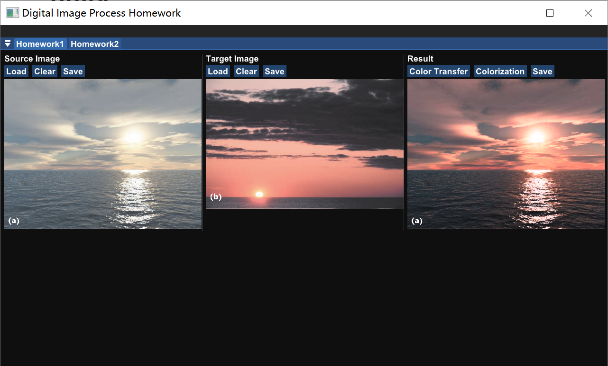
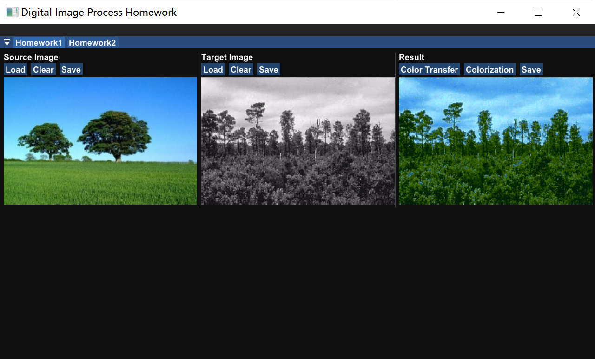
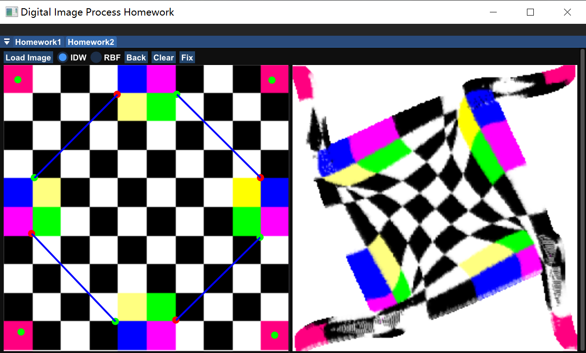
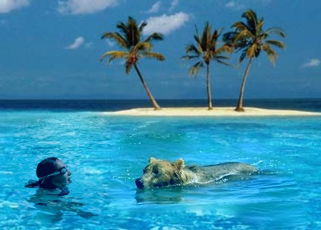
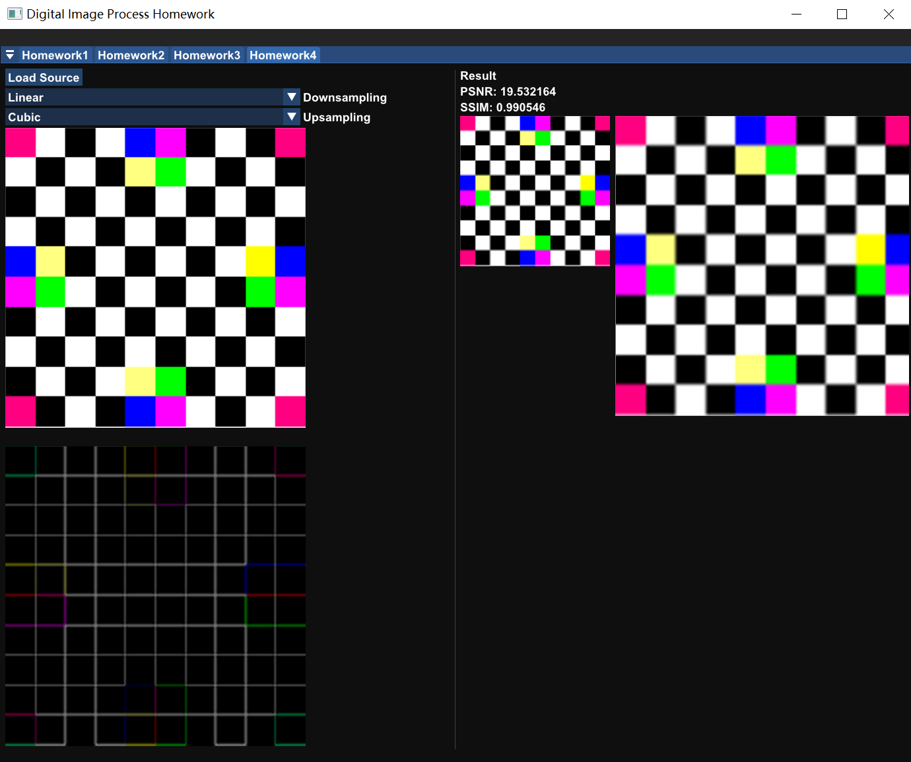

# Digital Image Process
## Introduction

> **MATH6420P: Digital Image Processing (Autumn-Winter 2021-2022)**
>
> **Instructors**: [Ligang Liu](http://staff.ustc.edu.cn/~lgliu/)
>
> **Webpage**: http://staff.ustc.edu.cn/~lgliu/Courses/DIP_2021_autumn-winter/default.htm

Platform:

* Windows 10
* Visual Studio 2019
* CMake >=3.14.0

Setup OpenCV

* Clone OpenCV source code from: [https://github.com/opencv/opencv](https://github.com/opencv/opencv)
* Clone OpenCV's extra modules source code from: [https://github.com/opencv/opencv_contrib](https://github.com/opencv/opencv_contrib)

* Build OpenCV with extra modules
* Install OpenCV
* Add `opencv-path/build/x64/vc15/bin` to system path
* Create system variable:
  * name: `OpenCV_DIR`
  * value: `opencv-path/build`

Clone project:

```sh
git clone https://github.com/Chaphlagical/DIP --recursive
```

Then, you can use CMake to build the project.

## Assignment

### Homework#1: Color Editing

**Color Transfer**



**Colorization**



### Homework#2 Image Warping



## Homework#3 Poisson Image Editing  



## Homework#4 Upsampling & Downsampling



